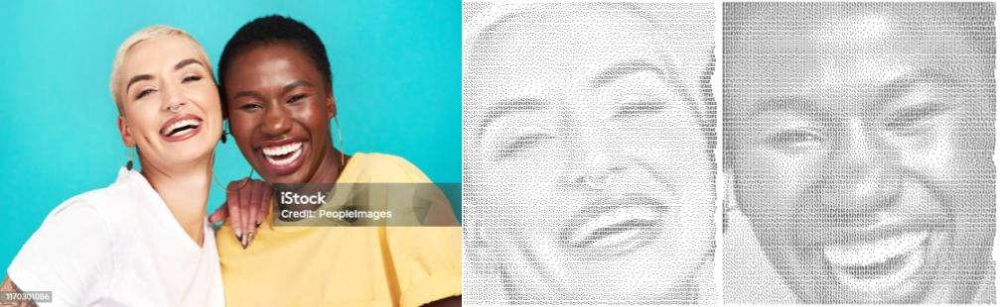

# ASCII-Art-Generator

Welcome to the ASCII Art Creator! This tool allows you to transform images into stunning ASCII art.




## Features

- **Image to ASCII Art**: Transform images into ASCII representations.
- **Supports Various Sizes**: Create both small and large ASCII art images.
- **Customizable Settings**: Adjust threshold value, algorithms, darkmode and more to fine-tune your art.
- **Human Faces Modes**: Includes two modes specifically for generating ASCII art from human faces in images.
- **Save and Share**: Save your creations by coping or as text files then share them as you like.

## Installation

To get started with the ASCII Art Generator, choose the option you like :

### On your machine using streamlit

1. Clone the repository:
    ```bash
    git clone --depth 1 https://github.com/your-username/ascii-art-creator.git
    ```

2. Navigate to the project directory:
    ```bash
    cd ASCII-Art-Generator
    ```

3. Install the necessary dependencies:
    ```bash
    pip install -r requirements.txt
    ```

4. Download the models
   ```bash
   mkdir weights && \ 
   wget https://download.pytorch.org/models/resnet18-5c106cde.pth -O weights/resnet18-5c106cde.pth && \
   wget --no-check-certificate 'https://docs.google.com/uc?export=download&id=154JgKpzCPW82qINcVieuPH3fZ2e0P812' -O weights/face_parsing.pth
   ```

5. Run time ! This will start the Streamlit app on port 8501. You can access it by navigating to http://localhost:8501 in your web browser. :
    ```bash
    streamlit run app.py 
    ```
    You can also set a different port number (Note that Streamlit will increment the port number if it is alwready used):
    ```bash
    streamlit run app.py --server.port 8080
    ```

### On your machine using docker

#### Prerequisites

Before you begin, ensure you have Docker installed on your machine. If not, download and install Docker from [here](https://docs.docker.com/engine/install/).

#### Steps

1. Clone the repository to your local machine:
    ```bash
    git clone https://github.com/your-username/ascii-art-creator.git --depth 1
    ```

2. Navigate to the project directory:
    ```bash
    cd ASCII-Art-Generator
    ```

3. Build the Docker image:
    ```bash
    docker build -t ascii-generator .
    ```
    This command will create a Docker image named **ascii-generator**.

4. Run the container
    ```bash
    docker run -p 1234:8501 ascii-generator 
    ```
    This will start the app on port 1234. You can access it by navigating to http://localhost:1234 in your web browser.


# License

This project is licensed under the [MIT License](LICENSE). You can find the full text of the license in the `LICENSE` file.

# References

- Face detection : [OpenCV using using Haar Cascades](https://docs.opencv.org/4.x/d2/d99/tutorial_js_face_detection.html)
- Face segmentation : [Face-parsing.PyTorch from zllrunning](https://github.com/zllrunning/face-parsing.PyTorch/tree/master)
- Dithering : [Luke Polson](https://github.com/lukepolson/youtube_channel/blob/main/Python%20Metaphysics%20Series/vid39.ipynb)

# TO DO
- Add GPU support for face segmentation